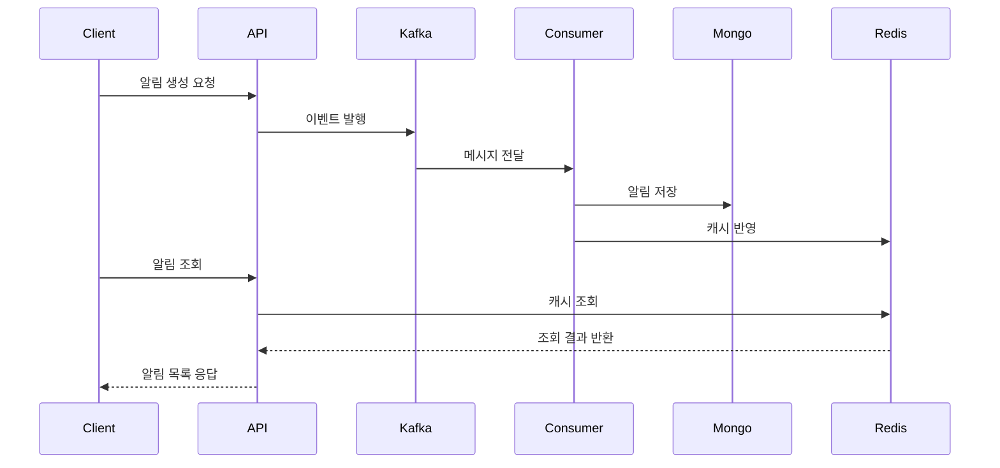

# 🚀 High-Performance SNS Notification Center  
### Kafka · MongoDB · Redis · Spring Boot 기반 확장형 알림 시스템

대규모 SNS 환경에서 발생하는 좋아요, 댓글, 팔로우 알림을  
안정적으로 처리하기 위한 **고성능 분산 알림센터 아키텍처**입니다.

본 시스템은 높은 트래픽에도 견딜 수 있도록  
**비동기 이벤트 스트림(Kafka)**, **문서 기반 저장소(MongoDB)**,  
그리고 **고속 캐시(Redis)** 기반으로 설계되었습니다.

알림 생성과 조회를 명확히 분리하여  
조회 지연 없이 안정적이고 확장성 높은 구조를 제공합니다.

---

## ✨ 주요 특징 (Key Features)

- **Kafka 기반 비동기 알림 처리**로 생성 트래픽과 조회 트래픽 완전 분리  
- **MongoDB TTL 인덱스**를 활용해 알림을 90일 후 자동 정리  
- **Redis 캐싱**으로 알림 조회 속도 극대화  
- **멀티 모듈 아키텍처**로 서비스 책임 명확화 및 확장성 확보  
- **시퀀스 다이어그램 기반 흐름 시각화**  
- **커서 기반 페이징**으로 무한 스크롤 대응

---

## 🧱 멀티 모듈 구성

```text
notification-center
 ├── core            공통 도메인 모델
 ├── api             REST API 계층
 ├── consumer        Kafka 이벤트 소비자
 ├── infrastructure  MongoDB, Redis, Kafka 설정
 └── common          예외 처리 및 공통 컴포넌트
```

---

## 🛰 시스템 아키텍처

```text
Client → API 서버 → Kafka → Consumer → MongoDB / Redis
```

알림 생성 흐름과 조회 흐름을 물리적으로 분리하여  
트래픽 증가에도 성능이 안정적으로 유지되도록 설계했습니다.

---

## 🔄 Sequence Diagram



---

## 🧩 핵심 API 명세

### • 알림 목록 조회  
`GET /api/notifications`  
최신순으로 20개 반환하며, pivot 기반 커서 페이징을 사용합니다.

---

### • 알림 읽음 처리  
`POST /api/notifications/read`  
마지막 읽음 시각을 기록하여 읽지 않은 알림을 구분합니다.

---

### • 신규 알림 여부 확인  
`GET /api/notifications/new`  
마지막 읽음 시각과 최신 알림 시각을 비교하여 새로운 알림 여부를 반환합니다.

---

## 🛠 기술 스택

**Language & Framework**  
• Java 21  
• Spring Boot  
• Spring Cloud Stream  

**Messaging**  
• Kafka  

**Database**  
• MongoDB  

**Cache**  
• Redis  

**Infrastructure**  
• Docker  
• Docker Compose  

**Testing**  
• Testcontainers 기반 통합 테스트  

---

## ⚡ 성능 전략

• Kafka Partition을 활용한 대량 이벤트 처리  
• Redis 캐시로 조회 지연 제거  
• MongoDB TTL 인덱스로 데이터 자동 정리  
• 생성과 조회를 분리한 서비스 구조로 확장성 확보  

---

## 📌 Why This Architecture?

대규모 SNS에서 알림 시스템은 가장 트래픽이 많이 몰리는 영역 중 하나입니다.  
이를 안정적으로 운영하기 위해 다음 설계를 적용했습니다.

- **Producer–Consumer 분리**  
  생성 트래픽 급증에도 조회 API가 영향받지 않도록 구조 분리  
- **비동기 이벤트 기반 처리**  
  대용량 생성 이벤트 병렬 처리  
- **NoSQL 기반 저장소 선택**  
  알림처럼 스키마가 자주 바뀌는 데이터에 최적화  
- **TTL 적용으로 운영 부담 감소**  

---

## 📎 추가 구현 예정

- FCM/APNs Push 알림 연동  
- Kafka Dead Letter Queue(DLQ) 추가  
- 알림 그룹핑 로직 고도화  
- OpenTelemetry 기반 Observability 강화  
